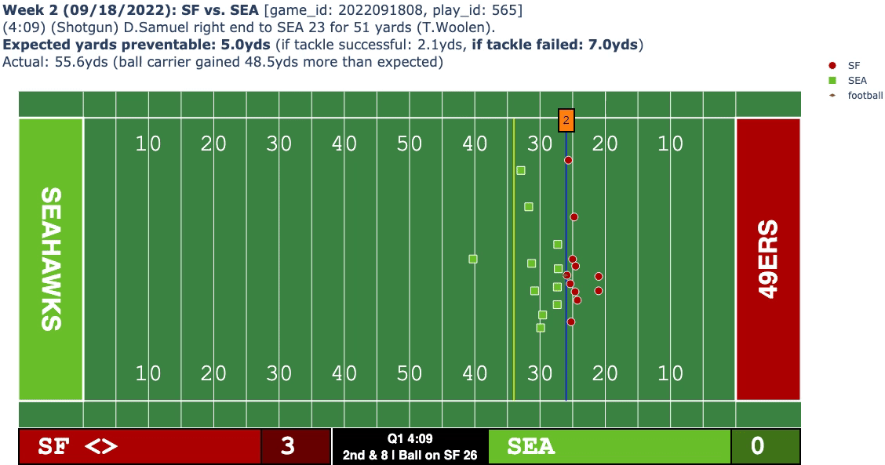

# TAPER: An Intuitive Metric for Measuring Yards Prevented by Tackles 

Official code repository for 2024 NFL Big Data Bowl (Kaggle) Metrics track submission. Find the original notebook [here](https://www.kaggle.com/trentonchang/nfl-bdb-24-yards-prevented-by-tackles).

Interactive demos can be found on my personal website [here](https://trentonchang.org/nfl-big-data-bowl-2024-demos/).

# Pipeline

To train your own models on the tracking data:
1. Run `preprocess_data.py` to generate the geometric and raw tracking features needed.
2. Create a configuration file in `configs/`.
3. Run `python main.py --config [YOUR_CONFIG]`. You can optionally visualize model training and validation statistics via `tensorboard --logdir .`.
4. Evaluate models using `python evaluate.py --ckpt-dir [YOUR_MODEL_DIR]`.
5. Use `postprocessed_eda.ipynb` to further analyze model outputs, and create interactive animations for each play to visualize model predictions. 
6. Optionally run `python animate.py --ckpt-path [YOUR_MODEL_DIR] --split [train,val,test] --indices [LIST_OF_INDICES]` to create an interactive HTML play visualization with model predictions. 

A link to the final model file on Google Drive can be found [here](https://drive.google.com/file/d/1aGQFLYcB5LzDfoFjlHZdaze_RfU_dw04/view?usp=sharing).
